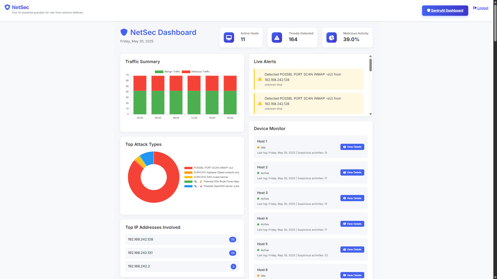
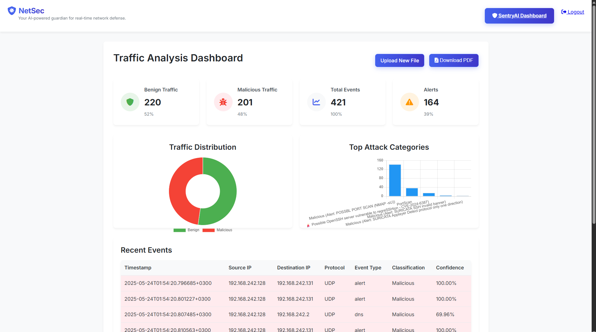
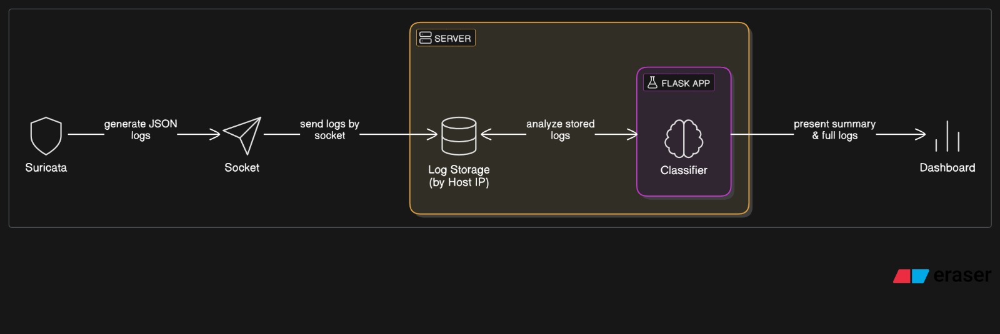

# 🛡️ NetSec – AI-Powered Real-Time Network Defense

A lightweight, intelligent, and scalable SIEM-like solution that provides real-time network traffic classification using **Suricata**, **XGBoost**, and a **Flask-based dashboard**.

> Graduation Project – El-Sewedy University of Technology  
> Faculty of Engineering Technology, Department of Computer Engineering Technology

---

## 📌 Project Overview

NetSec started as a basic vulnerability matcher but evolved into a real-time, multi-host traffic analysis platform. It integrates **Suricata NIDS**, **custom socket-based log aggregation**, and **machine learning models** to detect and classify malicious activity across a distributed network.

---

## 🔍 Key Features

- 🔁 **Real-Time Monitoring**: Collects Suricata logs from multiple hosts continuously.  
- 🧠 **Binary & Multi-Class Classification**: Detects malicious traffic and identifies the type of attack (DDoS, Botnet, PortScan, etc.).  
- ⚙️ **Socket-Based Log Transfer**: Clients send logs to a centralized server via a custom socket system.  
- 📊 **Flask Web Dashboard**: Provides interactive visualizations, log browsing, and result summaries.  
- 🧪 **Hybrid Detection**: Combines Suricata’s signature-based alerts with ML-powered classification.  
- 💡 **Lightweight SIEM**: Simulates core functions of a Security Information and Event Management system for small networks or research environments.

---

## 🧱 Project Structure

```
.
├── app.py                     # Flask web application
├── receiver_updated.py       # Socket receiver for Suricata logs
├── suricata_parser.py        # JSON log parser and preprocessor
├── models/                   # Trained ML models and label encoders
├── hosts/                    # Logs received from networked devices
├── uploads/                  # Sample and real Suricata EVE logs
├── static/                   # CSS styling
├── templates/                # HTML files for web dashboard
```

---

## 🤖 Machine Learning Models

| Model File                     | Description                               |
|-------------------------------|-------------------------------------------|
| `XGBoost_binary_retrained.pkl` | Detects if traffic is malicious or benign |
| `XGBoost_multi_retrained.pkl`  | Classifies type of attack (multi-class)   |
| `label_encoder_multi_retrained.pkl` | Converts prediction to readable label   |

- Trained on: [CICIDS2017 Dataset](https://www.unb.ca/cic/datasets/ids-2017.html) + real-world traffic  
- Performance: High accuracy (>97%) with minimal false positives

---

## 🚀 How to Run

1. Install dependencies:

```bash
pip install -r requirements.txt
```

2. Start the socket receiver:
```bash
python receiver_updated.py
```

3. Run the Flask web app:
```bash
python app.py
```

4. Access the dashboard at:
```
http://localhost:5000/
```

---

## 📸 Screenshots

### 🔍 System Dashboard  


### 📊 Prediction Results Table  


### 🧠 Architecture Diagram  


---

## 🧠 Use Case

This system is ideal for:
- University networks  
- Research labs  
- SMEs with limited cybersecurity budgets  
- Educational purposes in network security and machine learning  

---


## 📚 Resources

- [Suricata NIDS](https://suricata.io/)
- [CICIDS2017 Dataset](https://www.unb.ca/cic/datasets/ids-2017.html)
- [XGBoost](https://xgboost.readthedocs.io)
- [Flask Web Framework](https://flask.palletsprojects.com)

---

## 📜 License

MIT License — feel free to use and build upon this for educational or research purposes.

---

---

## 📬 Contact

If you'd like to connect, collaborate, or ask any questions about the project, feel free to reach out:

- 📧 Email: elnmrloaie3@gmail.com 
- 💼 LinkedIn: [Your LinkedIn Profile](https://linkedin.com/in/loay-mostafa-678095284)  
- 🐙 GitHub: [Your GitHub Username](https://github.com/yourusername)

---

